# Frontend Components

## Components

### Login Screen

The login screen is the first screen users will see when accessing the app. It includes a sign-up button and a brand logo. Users can enter their credentials to access their account or sign up for a new account. This component is reusable and can be used across the app.

### Room Management

The room management component is used by accounts with admin privileges to add or delete rooms. This component includes a list of all the rooms in the system, along with options to add new rooms or delete existing ones. It also allows admins to edit the details of each room.

### Calendar

The calendar component allows users to view all the available dates for booking a room. It includes tabs for daily, weekly, and monthly views, and each date button displays the list of bookers for that day. Users can select a date to view the available time slots for booking.

### Booking Form

The booking form component allows users to select the desired time slot and book a room. It includes fields for selecting the date, start time, and end time, as well as an option to add notes about the booking. Users can submit the form to complete the booking process.

### Dashboard

The dashboard component is the main hub of the app. It displays the user's upcoming bookings, along with options to create new bookings or view previous bookings. It also includes a search bar for finding available rooms and a notification system for important updates.

## Component Relationships

### Login Screen -> Dashboard

After successfully logging in or signing up, users are directed to the dashboard component, which serves as the main hub of the app.

### Dashboard -> Calendar

Users can navigate to the calendar component from the dashboard to view all available dates for booking a room.

### Calendar -> Booking Form

After selecting a date and time slot, users can navigate to the booking form component to complete the booking process.

### Dashboard -> Room Management

Users with admin privileges can access the room management component from the dashboard to add or delete rooms.

### Dashboard -> Notifications

Important updates and notifications are displayed in the dashboard component.

## Conclusion
By breaking down the front-end architecture into components and explaining how they relate to each other, we can better understand the overall structure of the app and how users will interact with it. This design can serve as a blueprint for developers to follow when building the app.